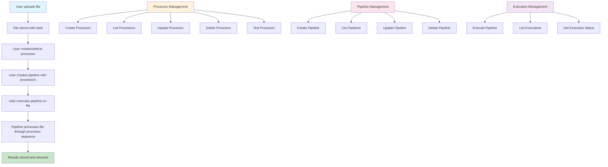

```mermaid
flowchart TD
    A["User uploads file"] --> B["File stored with hash"]
    B --> C["User creates/selects processor"]
    C --> D["User creates pipeline with processors"]
    D --> E["User executes pipeline on file"]
    E --> F["Pipeline processes file through processor sequence"]
    F --> G["Results stored and returned"]
    
    H["Processor Management"] --> I["Create Processor"]
    H --> J["List Processors"]
    H --> K["Update Processor"]
    H --> L["Delete Processor"]
    H --> M["Test Processor"]
    
    N["Pipeline Management"] --> O["Create Pipeline"]
    N --> P["List Pipelines"]
    N --> Q["Update Pipeline"]
    N --> R["Delete Pipeline"]
    
    S["Execution Management"] --> T["Execute Pipeline"]
    S --> U["List Executions"]
    S --> V["Get Execution Status"]
    
    style A fill:#e1f5fe
    style G fill:#c8e6c9
    style H fill:#fff3e0
    style N fill:#fce4ec
    style S fill:#f3e5f5
```